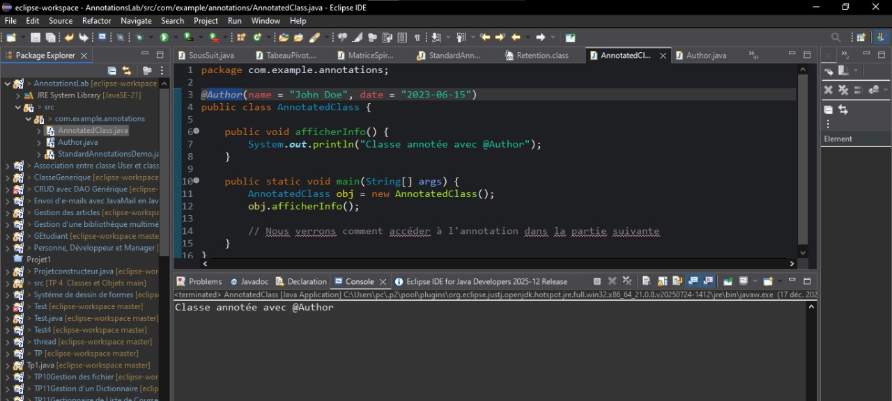
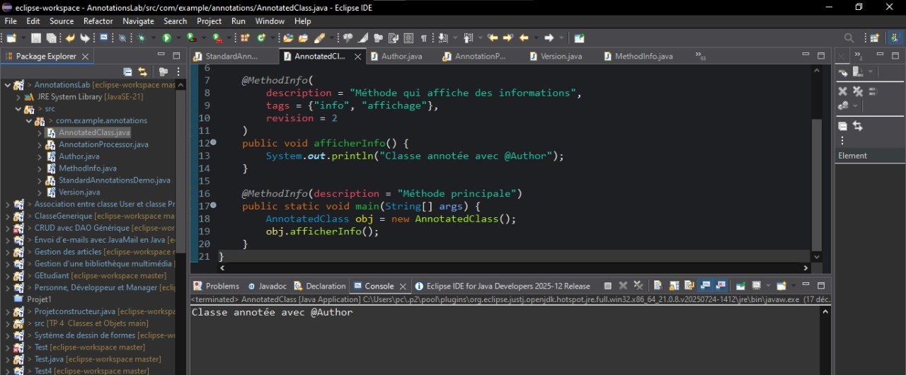
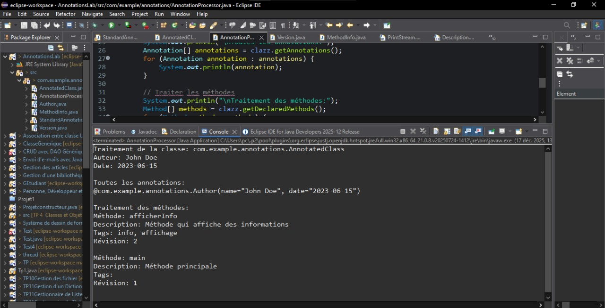
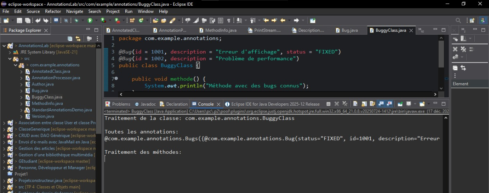
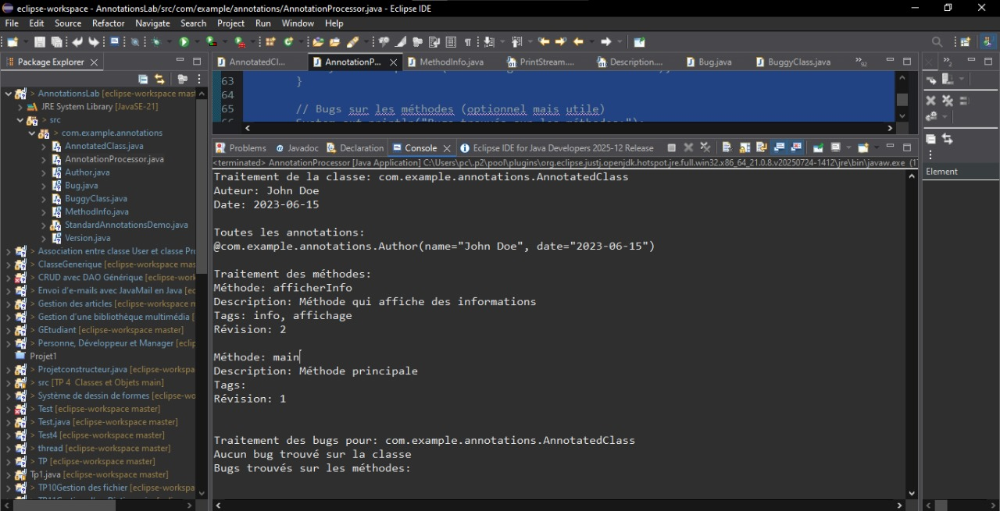
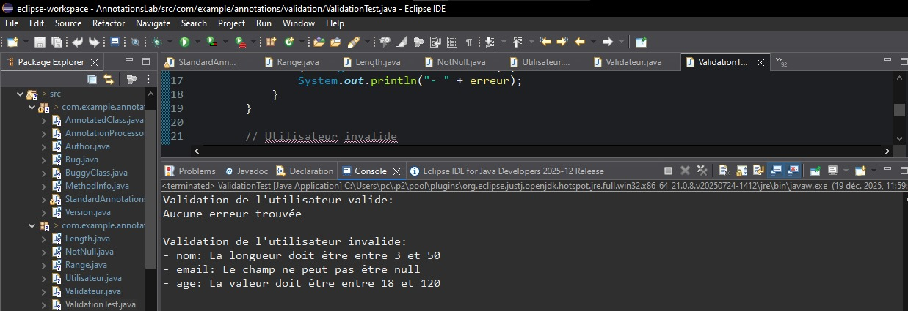
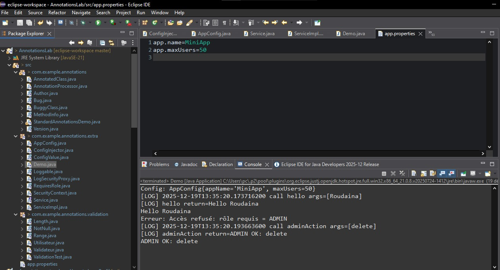

# TP 16 – Annotations Java

## 🎯 Objectif
Découvrir les annotations Java standards et personnalisées, et apprendre à les exploiter à l’aide de la réflexion (Reflection).

---

## 🧩 Contenu du TP

### 1️⃣ Annotations standards
- `@Deprecated`
- `@Override`
- `@SuppressWarnings`
Classe de démonstration : `StandardAnnotationsDemo`

---

### 2️⃣ Annotations personnalisées (classe & méthode)
- `@Author`
- `@Version`
- `@MethodInfo`

Classes :
- `AnnotatedClass`
- `AnnotationProcessor`

---

### 3️⃣ Réflexion (Reflection)
- Lecture des annotations de classes
- Lecture des annotations de méthodes
- Affichage dynamique des métadonnées

---

### 4️⃣ Annotations répétables
- `@Bug` (répétable)
- Traitement via `getAnnotationsByType`

Classe :
- `BuggyClass`

---

### 5️⃣ Annotations de validation
- `@NotNull`
- `@Length`
- `@Range`

Package :
- `com.example.annotations.validation`

Classes :
- `Utilisateur`
- `Validateur`
- `ValidationTest`

---

## ▶️ Exécution
- Lancer `StandardAnnotationsDemo` (annotations standards)
- Lancer `AnnotationProcessor` (lecture par réflexion)
- Lancer `BuggyClass` (annotations répétables)
- Lancer `ValidationTest` (validation des données)

---

## 🛠 Technologies utilisées
- Java SE
- Annotations
- Reflection
- Eclipse IDE

---

## ✅ Résultat attendu
- Compréhension des annotations Java
- Lecture dynamique des métadonnées
- Validation automatique des champs
- Base de fonctionnement des frameworks Java (Spring)

---

### 2️⃣ Annotations avancées
- `@Loggable` : journalisation des appels de méthodes
- `@RequiresRole` : contrôle d’accès par rôle
- `@ConfigValue` : injection de valeurs depuis un fichier de configuration

Classes principales :
- `LogSecurityProxy`
- `SecurityContext`
- `ConfigInjector`

---

## Resultat 

<div align="center">  <p><em>Figure 1</em></p> </div>


<div align="center">  <p><em>Figure 2</em></p> </div>


<div align="center">  <p><em>Figure 3</em></p> </div>


<div align="center">  <p><em>Figure 4</em></p> </div>


<div align="center">  <p><em>Figure 5</em></p> </div>


<div align="center">  <p><em>Figure 6</em></p> </div>

<div align="center">  <p><em>Figure 7</em></p> </div>
<div align="center">  <p><em>Figure 8</em></p> </div>


### 3️⃣ Configuration
- Fichier : `app.properties`
```properties
app.name=MiniApp
app.maxUsers=50
